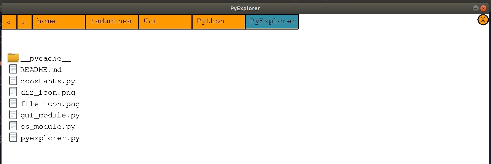

# PyExplorer
Pygame lightweight emulation of Linux's File Explorer (Nautilus).

Navigates through an user's local filesystem, just like Nautilus.

# Installation (Linux)

The project is written in Python and uses the Pygame module.

1. Python: `sudo apt-get install python 3.6`

2. Pygame: `sudo apt-get install python-pygame`

# How it works

## Opening it
+ Download the repo
+ Run **pyexplorer.py**:
    + Open the terminal *(Ctrl + Alt + T)*
    + Go to the directory where you downloaded the repo *(cd ...)*
    + `python3.6 pyexplorer.py`

## Playing with it

+ Press directory icons to access the respective directories
+ Use back/front buttons *(top-left corner)* to navigate in your filepath
    + To navigate quickly in your filepath, click on the respective directory you want to access

+ Press the bright orange close button *(top-right corner)* to close PyExplorer.

# Contributors

Made with love by team **double-tRouble** - [Radu Minea](https://github.com/raduqq) and [Radu Pavel](https://github.com/UkuPapuku).

# Contribute

Any contribution is appreciated. We have the following features all planned up:

+ Allowing the user to specify its starting directory
+ Navigating the filepath through arrow keys
+ Scaling filepath box size to directory name
+ Search bar